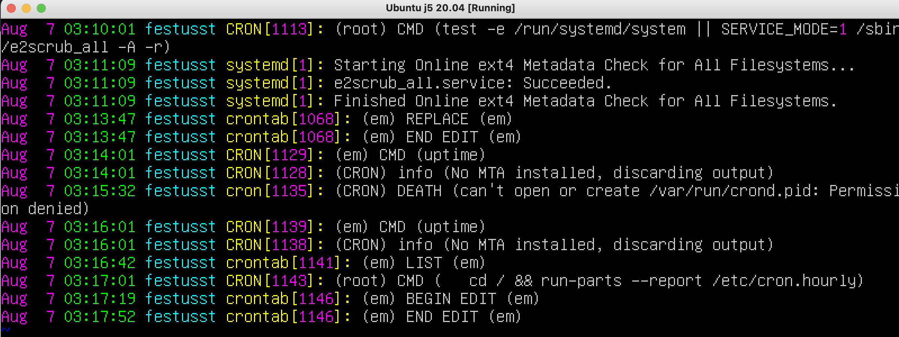

## Part 1. Установка ОС

Ubuntu version:


---

## Part 2. Создание пользователя

* Creation of a new user:


* cat /etc/passwd:


## Part 3. Настройка сети ОС

* Для изменения имени машины редактируем файл, находящийся по этому пути: 
```
/etc/hostname
```


* Меняем часовой пояс через команду ```timedatectl```


* Команда ```ip link show``` поможет вывести названия всех сетевых интерфейсов


_lo (loopback device) – виртуальный интерфейс, присутствующий по умолчанию в любом Linux. Он используется для отладки сетевых программ и запуска серверных приложений на локальной машине. С этим интерфейсом всегда связан адрес 127.0.0.1. У него есть dns-имя – localhost. Посмотреть привязку можно в файле /etc/hosts._


* IP-адрес, получаемый от DHCP:


__DHCP__  _(англ. Dynamic Host Configuration Protocol — протокол динамической настройки узла) — прикладной протокол, позволяющий сетевым устройствам автоматически получать IP-адрес и другие параметры, необходимые для работы в сети TCP/IP._

* Внутренний IP-адрес шлюза, он же IP-адрес по умолчанию:


* Внешний IP-адрес:
  


* Статический IP-адрес и DNS назначаем через config-файл ```netplan```


* Пингуется __"ВО"__!


## Part 4. Обновление ОС

* Через ```apt update ``` обновляем системные пакеты до последней версии:


## Part 5. Использование команды sudo

* __Sudo__ (англ. Substitute User and do, дословно «подменить пользователя и выполнить») — программа для системного администрирования UNIX-систем, позволяющая делегировать те или иные привилегированные ресурсы пользователям с ведением протокола работы. Основная идея — дать пользователям как можно меньше прав, при этом достаточных для решения поставленных задач. Программа поставляется для большинства UNIX и UNIX-подобных операционных систем.


* Даем пользователю _em_clone_ права sudo через ```sudo usermod -aG sudo em_clone ```
и меняем hostname, также редактируя файл ```/etc/hostname```


## Part 6. Установка и настройка службы времени

* Время часового пояса


## Part 7. Установка и использование текстовых редакторов

* Vim:
для выхода ```esc и wq```


* Nano:
для выхода ```ctrl + ```, далее ```Y```, чтобы сохранить изменения


* Joe:
для выхода ```ctrl + K```, далее ```X```, чтобы сохранить изменения


* Vim
для выхода без сохранения ```:q! ```


* Nano 
для выхода без сохранения ```ctrl + x ```, далее ```N```


* Joe
для выхода без сохранения ``` ctrl + c```, далее ```y``` 


* Vim
для поиска перейти в режим команд через ```esc``` далее ввести ```/<шаблон_для_поиска>```


для поиска по всему файлу и замены
```:%s/<слово_для_замены>/<слово_на_замену>```
в режиме редактирования


* Nano
для поиска ```ctrl+W```


для замены ```ctrl+\``` и ввести в поле строку для поиска и дальше строку для замены

* Joe 

для поиска ```ctrl+K далее F```


для замены выбрать ```R``` - replace и ввести строку для замены и ```Y```для подтверждения


## Part 8. Установка и базовая настройка сервиса SSHD

* Установить службу SSHd через команду ```sudo apt-get install ssh```

* Добавить автостарт службы при загрузке системы c помощью команды ```sudo systemctl enable ssh ```

* Перенастроить службу SSHd на порт 2022: 
отредактировать конфигурационный файл ```sudo vim /etc/ssh/sshd_config```


* Используя команду ps, показать наличие процесса sshd:

Через командц ```pd``` выводим по номеру процесса запущенный _sshd_ процесс
 

В целом все запущенные процессы можно просмотреть командой pd с флагом ```-e```


* Вывод команды netstat:


Можно добавить ключи:
__-t__ Список активных портов TCP
__-a__ Отображение всех подключений и ожидающих портов.
__-n__ Отображение адресов и номеров портов в числовом формате

Столбцы вывода:
__Proto__ - протокол
__Recv-Q__ - размер очереди приема, в байтах
__Send-Q__ - размер очереди получения, в байтах
__Local address__ - локальный адрес
__Foreign address__ - удаленный адрес
__State__ - внутреннее состояние протокола

0.0.0.0. в столбце foreign address означает, что подключений нет
0.0.0.0. в столбце local address означает, что ожидает входящих соединений на всех интерфейсах

## Part 9. Установка и использование утилит top, htop

* Top
    * uptime (время работы после загрузки): 1:11
    * количество авторизованных пользователей: 1
    * общую загрузку системы: 0.0
    * общее количество процессов: 95
    * загрузку cpu: 0.0
    * загрузку памяти: 146.3 used 
    * pid процесса занимающего больше всего памяти: 1 (systemd)
    * pid процесса, занимающего больше всего процессорного времени 1194 (top)


* __htop__ сортировка по:
    * PID
    

    * PERCENT_CPU
    

    * PERCENT_MEM
    

    * TIME
    


* __htop__ фильтр sshd:


*  __htop__ поиск syslog


*  __htop__ вывод доп полей


## Part 10. Использование утилиты fdisk

* название жесткого диска: VBOX HARDDISK
* его размер: 10 GiB
* количество секторов: 20971520
* размер swap: 1.7 GiB


## Part 11. Использование утилиты df
* размер раздела: 9299276
* размер занятого пространства: 4437680
* размер свободного пространства: 4367620
* процент использования: 51%


Определить и написать в отчёт единицу измерения в выводе: 1K-blocks (1024 байт)


* размер раздела: 8.9G
* размер занятого пространства: 4.3G
* размер свободного пространства: 4.2G
* процент использования: 51%
* Определить и написать в отчёт тип файловой системы для раздела: ext4


## Part 12. Использование утилиты du

* Запустить команду du


* Вывести размер папок 
/home

/var

/var/log 

 

* Вывести размер всего содержимого в /var/log (не общее, а каждого вложенного элемента, используя *)


## Part 13. Установка и использование утилиты ncdu

* Вывести размер папок 
/home

/var

/var/log 
 

## Part 14. Работа с системными журналами

* Написать в отчёте время последней успешной авторизации, имя пользователя и метод входа в систему: 02:47 festusst systemd-logind[650]

 

Перезапустить службу SSHd:
 


Вставить в отчёт скрин с сообщением о рестарте службы (искать в логах):

 

## Part 15. Использование планировщика заданий CRON


* Найти в системных журналах строчки (минимум две в заданном временном диапазоне) о выполнении:
 

* Вывести на экран список текущих заданий для CRON:
 


Удалите все задания из планировщика заданий.
В отчёт вставьте скрин со списком текущих заданий для CRON:
```crontab -r``` - удалить

 