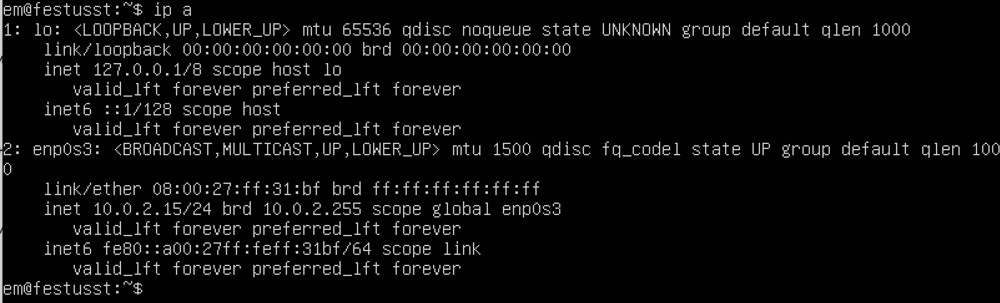
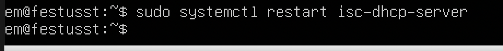

## Part 1. Инструмент ipcalc
* ### 1.1. Сети и маски
    * Адрес сети 192.167.38.54/13 - 192.160.0.0
    * Перевод маски 255.255.255.0:
        * в префиксную: /24
        * двоичную запись: 11111111.11111111.11111111.00000000 
    * /15:
        * в обычную: 255.254.0.0
        * двоичную: 11111111.11111110.00000000.00000000
    * 11111111.11111111.11111111.11110000:
        * в обычную: 255.255.255.240
        * префиксную: /28
    
    * Минимальный и максимальный хост в сети 12.167.38.4 при масках: 
        * /8 - 12.0.0.1 и 12.255.255.254
        * 11111111.11111111.00000000.00000000 - 12.167.0.1 и 12.167.255.254
        * 255.255.254.0 - 12.167.38.1 и 12.167.39.254
        * /4 - 0.0.0.1 и 15.255.255.254

* ### 1.2. localhost

    * Определить и записать в отчёт, можно ли обратиться к приложению, работающему на localhost, со следующими IP: 
    194.34.23.100 - NO
    127.0.0.2 - YES
    127.1.0.1 - YES
    128.0.0.1 - NO

* ### 1.3. Диапазоны и сегменты сетей
    * Какие из перечисленных IP можно использовать в качестве публичного, а какие только в качестве частных: 
    10.0.0.45 - private
    134.43.0.2 - public
    192.168.4.2 - private
    172.20.250.4 - private
    172.0.2.1 - public
    192.172.0.1 - public 
    172.68.0.2 - public
    172.16.255.255 - private 
    10.10.10.10 - private
    192.169.168.1 - public

    There are classifications of IP addresses as "private" and "public". The following ranges of addresses are reserved for private (aka LAN) networks:
    10.0.0.0 — 10.255.255.255 (10.0.0.0/8),
    172.16.0.0 — 172.31.255.255 (172.16.0.0/12),
    192.168.0.0 — 192.168.255.255 (192.168.0.0/16).
    127.0.0.0 — 127.255.255.255 (Reserved for loopback interfaces (not used for communication between network nodes), so called localhost).

    * Какие из перечисленных IP адресов шлюза возможны у сети 10.10.0.0/18: 
    10.0.0.1 - NO
    10.10.0.2 - YES
    10.10.10.10 - YES
    10.10.100.1 - NO
    10.10.1.255 - YES


## Part 2. Статическая маршрутизация между двумя машинами
* Поднять две виртуальные машины (далее -- ws1 и ws2.
С помощью команды __ip a__ посмотреть существующие сетевые интерфейсы:



 * Описать сетевой интерфейс, соответствующий внутренней сети, на обеих машинах и задать следующие адреса и маски: ws1 - 192.168.100.10, маска /16, ws2 - 172.24.116.8, маска /12
В отчёт поместить скрины с содержанием изменённого файла etc/netplan/00-installer-config.yaml для каждой машины.


* Выполнить команду netplan apply для перезапуска сервиса сети. В отчёт поместить скрин с вызовом и выводом использованной команды.


* 2.1. Добавление статического маршрута вручную
Добавить статический маршрут от одной машины до другой и обратно при помощи команды вида ip r add.
Пропинговать соединение между машинами:

 


### 2.2. Добавление статического маршрута с сохранением

Перезапустить машины. Добавить статический маршрут от одной машины до другой с помощью файла etc/netplan/00-installer-config.yaml
В отчёт поместить скрин с содержанием изменённого файла etc/netplan/00-installer-config.yaml:


 

Пропинговать соединение между машинами. В отчёт поместить скрин с вызовом и выводом использованной команды:


## Part 3. Утилита iperf3
* ### 3.1. Скорость соединения
Перевести и записать в отчёт: 
8 Mbps - 1 MB/s
100 MB/s - 800000 Kbps
1 Gbps - 1000 Mbps

* ### 3.2. Утилита iperf3
Измерить скорость соединения между ws1 и ws2. В отчёт поместить скрины с вызовом и выводом использованных команд.


## Part 4. Сетевой экран
* В отчёт поместить скрины с содержанием файла /etc/firewall для каждой машины.


* В отчёт поместить скрины с запуском обоих файлов. 


* В отчёте описать разницу между стратегиями, применёнными в первом и втором файлах:

Действия для таблицы FILTER являются терминальными, т.е. прекращают прохождение пакета по цепочке.
В первом случае сработает правило DROP и дальше пакет не пойдет, во втором наоборот.


### 4.2. Утилита nmap

Командой ping найти машину, которая не "пингуется", после чего утилитой nmap показать, что хост машины запущен:


## Part 5. Статическая маршрутизация сети
####5.1. Настройка адресов машин
* Настроить конфигурации машин в etc/netplan/00-installer-config.yaml согласно сети на рисунке. В отчёт поместить скрины с содержанием файла etc/netplan/00-installer-config.yaml для каждой машины.


* Перезапустить сервис сети:
__sudo netplan apply__

* Если ошибок нет, то командой ip -4 a проверить, что адрес машины задан верно:
_ws11:_


_r1:_


_r2:_


_ws21:_


_ws22:_


Также пропинговать ws22 с ws21:


Аналогично пропинговать r1 с ws11:


####5.2. Включение переадресации IP-адресов.

* Для включения переадресации IP, выполните команду на роутерах:
sysctl -w net.ipv4.ip_forward=1
При таком подходе переадресация не будет работать после перезагрузки системы.

В отчёт поместить скрин с вызовом и выводом использованной команды:

_r1:_


_r2:_


Откройте файл /etc/sysctl.conf и добавьте в него следующую строку:
net.ipv4.ip_forward = 1
При использовании этого подхода, IP-переадресация включена на постоянной основе.
В отчёт поместить скрин с содержанием изменённого файла /etc/sysctl.conf:

_r1:_


_r2:_


####5.3. Установка маршрута по-умолчанию

* Настроить маршрут по-умолчанию (шлюз) для рабочих станций. Для этого добавить default перед IP роутера в файле конфигураций.
В отчёт поместить скрин с содержанием файла etc/netplan/00-installer-config.yaml:

_ws11:_


_ws21:_


_ws22:_


* Вызвать ip r и показать, что добавился маршрут в таблицу маршрутизации.
В отчёт поместить скрин с вызовом и выводом использованной команды:

_ws11:_


_ws21:_


_ws22:_


* Пропинговать с ws11 роутер r2 и показать на r2, что пинг доходит. Для этого использовать команду:
__tcpdump -tn -i eth1__
В отчёт поместить скрин с вызовом и выводом использованных команд.


####5.4. Добавление статических маршрутов

* Добавить в роутеры r1 и r2 статические маршруты в файле конфигураций. В отчёт поместить скрины с содержанием изменённого файла etc/netplan/00-installer-config.yaml для каждого роутера:

_r1:_


_r2:_


Вызвать ip r и показать таблицы с маршрутами на обоих роутерах. В отчёт поместить скрин с вызовом и выводом использованной команды:

_r1:_


_r2:_


Запустить команды на ws11:
ip r list 10.10.0.0/[маска сети] и ip r list 0.0.0.0/0
В отчёт поместить скрин с вызовом и выводом использованных команд:


В отчёте объяснить, почему для адреса 10.10.0.0/[маска сети] был выбран маршрут, отличный от 0.0.0.0/0, хотя он попадает под маршрут по-умолчанию.

Для локальной подсети 10.10.0.0/18 у нас отдельный маршрут, чтобы пакеты не отправлялись на все остальные адреса, входящие в 0.0.0.0/0


## 5.5. Построение списка маршрутизаторов

Запустить на r1 команду дампа:
```tcpdump -tnv -i eth0```


* При помощи утилиты traceroute построить список маршрутизаторов на пути от ws11 до ws21:


* В отчёт поместить скрины с вызовом и выводом использованных команд (tcpdump и traceroute). В отчёте, опираясь на вывод, полученный из дампа на r1, объяснить принцип работы построения пути при помощи traceroute:

_Чтобы доставить пакет от ws11 (IP 10.10.0.2) до ws21(IP 10.20.0.10, он пройдет через шлюз 10.0.0.1 и там свяжется со шлюзом 10.100.0.12 и через него попадет в нужную подсеть 10.20.0.0/26. На tcpdump видно, как ПК связывается с роутером, который является шлюзом по умолчанию, и с помощью ARP запроса они  узнают кому принадлежит нужный IP адрес._

## 5.6. Использование протокола ICMP при маршрутизации

* Запустить на r1 перехват сетевого трафика, проходящего через eth0 с помощью команды:
```tcpdump -n -i eth0 icmp```
* Пропинговать с ws11 несуществующий IP (например, 10.30.0.111) с помощью команды:
```ping -c 1 10.30.0.111```

   В отчёт поместить скрин с вызовом и выводом использованных команд:


## Part 6. Динамическая настройка IP с помощью DHCP

* Для r2 настроить в файле /etc/dhcp/dhcpd.conf конфигурацию службы DHCP:

    1) указать адрес маршрутизатора по-умолчанию, DNS-сервер и адрес внутренней сети:


    2) в файле resolv.conf прописать nameserver 8.8.8.8:


* Перезагрузить службу DHCP командой systemctl restart isc-dhcp-server. Машину ws21 перезагрузить при помощи reboot и через ip a показать, что она получила адрес. Также пропинговать ws22 с ws21.

__r2:__


__ws21:__


__ping ws21-ws22:__


* Указать MAC адрес у ws11, для этого в etc/netplan/00-installer-config.yaml надо добавить строки: macaddress: 10:10:10:10:10:BA, dhcp4: true. В отчёт поместить скрин с содержанием изменённого файла etc/netplan/00-installer-config.yaml:


* Для r1 настроить аналогично r2, но сделать выдачу адресов с жесткой привязкой к MAC-адресу (ws11). Провести аналогичные тесты. В отчёте этот пункт описать аналогично настройке для r2:

__r1:__


__ws11:__

* Задаем на ws11 новый mac-адрес в файле /etc/netplan/*.yaml:


* Также меняем mac-адрес адаптера в настройках сети Virtual Box - это специфика смены mac-адреса на виртуальной машине.

* Перезагружаем ws11 командой reboot и проверяем выдался ли ip через команду ```ip a```:


Все машины в этой и смежной сети пингуются:


* Запросить с ws21 обновление ip адреса. В отчёте поместить скрины ip до и после обновления:


В отчёте описать, какими опциями DHCP сервера пользовались в данном пункте:

Сначала мы через команду ```dhclient -r``` освобождаем выданный нам IP, а потом запрашиваем новый через команду ```dhclient```.


## Part 7. NAT
* В файле ```/etc/apache2/ports.conf``` на ws22 и r1 изменить строку Listen 80 на Listen 0.0.0.0:80, то есть сделать сервер Apache2 общедоступным

__ws22:__


__r1:__


* Запустить веб-сервер Apache командой ```service apache2 start``` на ws22 и r1. В отчёт поместить скрины с вызовом и выводом использованной команды:

__ws22:__


__r1:__


* Добавить в фаервол, созданный по аналогии с фаерволом из Части 4, на r2 следующие правила:


* Проверить соединение между ws22 и r1 командой ping. При запуске файла с этими правилами, ws22 не должна "пинговаться" с r1.
В отчёт поместить скрины с вызовом и выводом использованной команды:


* Добавить в файл ещё одно правило:
Разрешить маршрутизацию всех пакетов протокола ICMP.
Запускать файл также, как в Части 4. Проверить соединение между ws22 и r1 командой ping. При запуске файла с этими правилами, ws22 должна "пинговаться" с r1.
В отчёт поместить скрины с вызовом и выводом использованной команды:


* Включить SNAT, а именно маскирование всех локальных ip из локальной сети, находящейся за r2 (по обозначениям из Части 5 - сеть 10.20.0.0)

* Включить DNAT на 8080 порт машины r2 и добавить к веб-серверу Apache, запущенному на ws22, доступ извне сети. В отчёт поместить скрин с содержанием изменённого файла:


* Проверить соединение по TCP для SNAT, для этого с ws22 подключиться к серверу Apache на r1 командой: ```telnet [адрес] [порт]```


* Проверить соединение по TCP для DNAT, для этого с r1 подключиться к серверу Apache на ws22 командой telnet (обращаться по адресу r2 и порту 8080):


## Part 8. Дополнительно. Знакомство с SSH Tunnels 

* Запустить веб-сервер Apache на ws22 только на localhost (то есть в файле /etc/apache2/ports.conf изменить строку Listen 80 на Listen localhost:80):


* Воспользоваться Local TCP forwarding с ws21 до ws22, чтобы получить доступ к веб-серверу на ws22 с ws21:


Проверяем соединение через telnet:


* Воспользоваться Remote TCP forwarding c ws11 до ws22, чтобы получить доступ к веб-серверу на ws22 с ws11:


Проверяем соединение через telnet:

